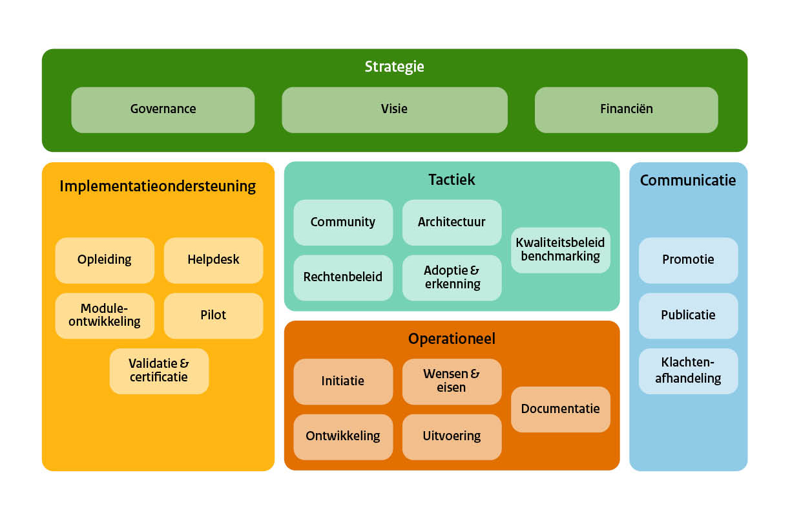

# Inleiding

Deze handreiking is een uitbreiding op het Beheer- en Onwikkelmodel 
Open standaarden (BOMOS). BOMOS is ontwikkeld als hulp in het inrichten 
van het open beheer van standaarden. De beheerprincipes waar BOMOS van 
uitgaat zijn ook toepasbaar op het beheer van (afspraken)stelsels en op
het beheer van open source code. 

Het internet is niet denkbaar zonder open source software.
Met het toenemende belang van netwerkdiensten is ook open source steeds
belangrijker geworden.

Om de module te onderscheiden van BOMOS voor standaarden noemen we het _BOMOSS_,
het Beheer- en Ontwikkelmodel voor Open Source Software.

## De BOMOS activiteiten

BOMOS kent een aantal activiteiten die delen van het standaardenbeheerproces invullen. 
Deze activiteiten worden ook in BOMOSS aangehouden hoewel ze net allemaal even relevant
zijn voor het beheerproces van open source code.

Activiteiten als _community_, _financiën_ en _rechtenbeleid_ zijn in het byzonder relevant 
voor open source code. Deze activiteiten krijgen dan ook extra aandacht in BOMOSS.

## Open standaarden en open source

Open standaarden hebben hun plek binnen de overheid voor een belangrijk deel te danken aan het actieplan 
[Nederland open in verbinding](https://www.digitaleoverheid.nl/document/actieplan-nederland-open-in-verbinding/) 
uit 2007. De open verbinding die het actieplan nastreefde moest niet allen met standaarden bereikt worden 
maar ook met het toepassen van open source in de digitale overheid. Open standaarden hebben hun plek in 
de overheid gekregen door het opnemen van standaarden op de pas toe of leg uit lijst die wordt beheerd 
door het Forum voor Standaardisatie. Voor het beheer van open standaarden is in Nederland het Beheer- 
en ontwikkelmodel open standaarden (BOMOS) ontwikkeld. Met versie 3 is de scope hiervan verbreed met 
het beheer van afsprakenstelsels.

Open source als principe voor de digitale overheid is teruggekeerd op de agenda. Uit studies [[Krechmer2002]] 
komen overeenkomsten naar voren tussen het beheer van open standaarden en open source code. 
Uit die studies komen adviezen hoe open source en open standaarden elkaar kunnen versterken.

### Europees perspectief

De EU heeft een onderzoek laten uitvoeren naar de overeenkomsten en de mogelijkheden tot wederzijdse 
versterking van open source en standaarden ontwikkeling [[JRC117836]]. De scope van de studie is de 
EU als organisatie, niet van de lidstaten. Er wordt uitgegaan van standaardenbeheerorganisaties op 
Europees (of internationaal) niveau. Binnen deze organisaties (zoals bijvoorbeeld W3C en OASIS) hebben 
de grote IT bedrijven en sterke rol. Binnen Nederlandse context is deze commercieele invloed veel kleiner. 
Binnen Nederlands beheerorganisaties richten we ons ook meer op het ontwikkelen van profielen op 
internationale standaarden en participeren we in internationale standaardenorganisaties. 
In de studie wordt een literatuuronderzoek gepresenteerd en een aantal case studies.

In de literatuurstudie vond men drie scenarios waarin standaardbeheer en open source op elkaar aan kunnen sluiten:
1. Standards implemented as OSS (“standard first”)
2. OSS code as input into a standard (“software implementation first”)
3. OSS and standardisation in parallel (“standard and implementation of standard in parallel”)

De conclusies en aanbevelingen van de studie zijn ook binnen de Nederlandse context interessant. Met name de aansluiting op beleid. De studie concludeert onder meer dat “formalized decision making in SDOs provides stability and acceptance, for example in the interaction with policy makers”. De aansluiting van de besluitvorming in standaarden op de GDI overleggen die we in 2023 gerealiseerd hebben kan als inspiratie dienen om beleid invloed te geven binnen open source projecten van de overheid.
Aanbevelingen uit het rapport

De studie geeft een aantal aanbevelingen aan standaardbeheerorganisaties, open source gemeenschappen 
en beleidsmaker. De meesten zijn gericht op intellectueel eigendom en de aanbeveling om een standaard 
ook vrij beschikbaar te maken.. Een aantal is ook relevant in deze context van dit document:
- Aan standaardbeheerorganisaties: We recommend a closer collaboration with OSS communities, because it might support SDOs in efforts to speed up the processes and to increase the agility of standards development.
- Aan open source gemeenschappen: Larger OSS communities should consider in engaging in the development of future strategies according to (WTO) standardisation principles,
- Aan beleidsmakers: SDOs and OSS engage in a healthy competition from the process perspective. We recommend the European Commission to create a level playing field between SDOs and OSS communities to foster innovation. This requires creating exchanges between the evolutionary selection process in OSS communities and the formalization within SDOs, but also may add additional obligations, like working with multi-stakeholder platforms or adherence to minimal standards for governance norms.

Samenvattend: een wisselwerking tussen beheerorganisaties voor standaarden en open source kan voro verbetering zorgen van beiden en zorgen voor een beter aansluiting van de beheerprocessen door aansluiting bij multi-stakeholder platforms. Die aansluiting kan ook gerealiseerd worden door toepassing van BOMOS principes en activiteiten.
